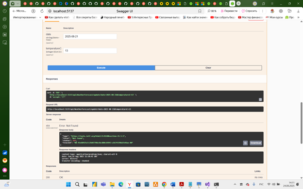

# Домашняя работа к семинару 9 Урок 18. Семинар: Способы организации передачи данных между компонентами приложения, протоколы и API. REST, gRPC, очереди

Доработать Web-приложение, разработанное на уроке, добавить поддержку обработки запроса на обновление и удаление данных (http запросы PUT и DELETE), доработать компонент WeatherForecastHolder по части удаления данных.

Если с языком C# дела обстоят плохо, можно разработать подобный сервис на той технологии, которая вам ближе.

Разработать экранные формы интерфейса для заказа ресурсов в облачном сервисе в https://www.figma.com/ или https://app.diagrams.net/.

Разработать полную ERD домена в https://www.dbdesigner.net/.

Дополнить swagger ответами домена (сутевые ответы) о статусе заказа ресурсов (создан, ошибка, нет ответа) и смоделировать ошибки REST «400, 500» типов.

Имплементировать сгенерированный swagger код в приложения студента.

